# WordPress QA project rules

Use the project skills under `skills/` for WordPress and WooCommerce QA following a modular, 3-mode testing architecture with strict Deletion Protection Hooks.

## Primary mode: admin-only Visual & Content QA

When the tester has only a wp-admin login (no SSH, WP-CLI, database or code), use `/wp-qa-agent:wp-check <request>`:
`wp-admin-access` (login, environment, inventory) → `wp-visual-content-qa` (plan → `node scripts/visual-qa.mjs run` → agent review → `node scripts/visual-qa.mjs finalize`).
This mode is read-only by construction: the scanner sends GET requests only (plus the login form), refuses nonce/action/logout/add-to-cart URLs, and aborts same-origin non-GET requests issued by the page. The verdict is computed by `finalize`, never written by the agent.

## Deletion Protection Policy (Mandatory Hook)

**Any operation that deletes files, database entries, posts, users, plugins, options, or test fixtures IS BLOCKED BY DEFAULT** and requires explicit human confirmation.

- **Interactive Execution:** Asks user confirmation: `Do you confirm deleting "<target>"? (y/N)`
- **Automated / CI Execution:** Refuses execution unless `QA_ALLOW_DELETION=true` is explicitly set in `.env.qa`.
- **Guarded patterns:** `scripts/deletion-guard.mjs` (`isDangerousCommand`, `confirmDeletion`, `safeRemove`) recognises `rm`, `unlink`, `wp post delete`, `wp user delete`, `wp option delete`, `wp db reset`, `DROP TABLE`, `DELETE FROM` for scripts that call it. There is no harness hook on shell commands: commands the agent runs directly go through Claude Code's normal permission prompts, so skills must not pre-approve unrestricted `Bash` (a single fixed script such as `Bash(node scripts/visual-qa.mjs:*)` is allowed).
- **Git Hook Protection:** Pre-commit hook lives at `.githooks/pre-commit` — version-controlled and shipped with the repo, not generated into the untracked `.git/hooks/` folder. `npm install` runs `scripts/install-hooks.mjs` via the `prepare` lifecycle script, which sets `git config core.hooksPath .githooks` so every clone/CI checkout gets it automatically. It blocks committing deletions of protected QA files (`qa/test-catalog.json`, `qa/findings.json`, `qa/status.md`, `tests/seed.spec.ts`, `AGENTS.md`). An intended deletion goes through when the commit runs with `QA_ALLOW_DELETION=true`.

---

## Write / Mutation Protection Policy (Mandatory Hook)

**Any operation that changes data on the target site** — creating/updating posts, pages, users, options, settings, comments; installing/activating/updating plugins or themes; submitting forms, checkout, or payment flows — **IS BLOCKED BY DEFAULT** and requires explicit human confirmation, exactly like deletions. Read-only browsing, screenshots, and GET requests are never blocked.

- **Interactive Execution:** Asks user confirmation before every mutating action: `Do you confirm this change on the site: "<action>"? (y/N)` (`scripts/write-guard.mjs` → `confirmWrite()`).
- **Automated / CI Execution:** Refuses execution unless `QA_ALLOW_WRITES=true` is explicitly set in `.env.qa`.
- **Guarded patterns:** `scripts/write-guard.mjs` (`isWriteCommand`, `confirmWrite`) recognises `wp post|page|user|option|term|comment create|update`, `wp plugin install|activate|deactivate|update`, `wp theme install|activate|update`, `wp core update`, `curl -X POST|PUT|PATCH|DELETE`, `INSERT INTO`, `UPDATE ... SET` for scripts that call it. As with deletions, there is no harness hook on shell commands.
- **Related toggles:** `QA_ALLOW_UPDATES` (plugin/theme/core updates), `QA_ALLOW_EMAIL`, `QA_ALLOW_PAYMENTS`, `QA_ALLOW_REFUNDS` — each stays `false` by default and gates its own category of mutation.
- **Scope:** applies everywhere, including production. Since this project only has browser-level access to the live site (no WP-CLI/SSH), fixture creation and state changes go through the WordPress REST API or wp-admin UI automation — both still pass through the same confirmation gate before anything is written.
- **wp-admin browser actions (Playwright MCP / Chrome DevTools MCP):** `scripts/write-guard.mjs` only sees shell/WP-CLI/curl commands. The actual path the agent uses to touch wp-admin is browser automation through the MCP tools (`mcp__playwright__*`, `mcp__chrome-devtools__*`), which never goes through Bash. This is gated separately by a **PreToolUse hook** (`.claude/settings.json` and the plugin's `hooks/hooks.json` → `scripts/wp-admin-write-guard.mjs`, matcher `mcp__.*(playwright|chrome-devtools).*`): any click, type, fill, drag, select, file upload, dialog handling, or script evaluation on those tools is routed to `permissionDecision: "ask"` — the agent cannot save/change anything in wp-admin without a human approving that specific tool call. Read-only actions (navigate, screenshot, snapshot, console/network inspection) are explicitly allowed and never prompt. An unrecognized/new MCP tool action defaults to `ask` (fail-safe). This is a harness-level control, independent of what the agent decides to do — it cannot be bypassed by instructions in a prompt. Navigation is allowed without a prompt, so a GET to a nonce URL (`?action=…&_wpnonce=…`) through MCP is not stopped by this hook — the visual scanner has its own URL filter for that reason. `.claude/settings.json` is the mechanism verified to run in this repo; `hooks/hooks.json` ships the same hook for plugin installs but has not been verified against a live browser MCP session.

---

## Workflow Modes

Instead of a single compulsory 17-step pipeline on every run, the workflow is split into 3 practical execution modes plus an opt-in Planner mode:

```mermaid
flowchart TD
    Start{"Choose Mode"} --> Fast["npm run qa:fast"]
    Start --> Update["npm run qa:update"]
    Start --> Full["npm run qa:full"]
    Start --> Plan["npm run qa:plan"]

    subgraph FastMode["Fast Mode (Daily Smoke/E2E)"]
        F1["Environment Guard"] --> F2["Optional Fixtures"]
        F2 --> F3["Playwright E2E Tests"]
        F3 --> F4["State Verifier (Mutations Only)"]
        F4 --> F5["Update Tracker & Short Report"]
    end

    subgraph UpdateMode["Update Mode (Plugin/Theme/WP Update)"]
        U1["Environment Guard"] --> U2["Version Snapshot & Backup"]
        U2 --> U3["Fixtures"]
        U3 --> U4["Critical Playwright Tests"]
        U4 --> U5["Visual Comparison"]
        U5 --> U6["State Verifier"]
        U6 --> U7["Tracker & Report"]
    end

    subgraph FullMode["Full Mode (Release & Pre-audit)"]
        L1["Environment Guard"] --> L2["Static Analysis (PHPCS/ESLint/Stylelint)"]
        L2 --> L3["PHPUnit Tests"]
        L3 --> L4["Plugin Check (if plugin)"]
        L4 --> L5["Full Playwright"]
        L5 --> L6["Axe Accessibility & Visual"]
        L6 --> L7["State Verifier & Comprehensive Report"]
    end

    subgraph PlanMode["Planner Mode (Site Exploration)"]
        P1["Environment Guard"] --> P2["Playwright Planner (Explore Site)"]
        P2 --> P3["Human Gate: Approve Test Plan"]
        P3 --> P4["Register Plan in Catalog"]
        P4 --> P5["Playwright Generator (Generate Specs)"]
        P5 --> P6["Validate Specs & Human Code Review"]
    end

    Fast --> FastMode
    Update --> UpdateMode
    Full --> FullMode
    Plan --> PlanMode
```



The diagram shows the skill-driven workflow. `scripts/run-qa.mjs` automates only part of it — see "Commands & Execution" for what each npm script actually does.

---

## Commands & Execution

- `/wp-qa-agent:wp-check <request>` — admin-only visual & content QA (primary mode).
- `npm run qa:inventory` — log in, read Site Health and list pages (`-- --login-manual` for 2FA/captcha).
- `npm run qa:visual -- run <plan.json>` / `npm run qa:visual -- finalize <run-dir>` — the scanner and verdict used by `/wp-qa-agent:wp-check`.
- `npm run qa:setup` — checks installed tools and points Git at `.githooks/` (also runs on `npm install`).
- `npm run qa:fast` — runs the E2E specs in `tests/`; `BLOCKED` when no test executed.
- `npm run qa:update` — same E2E run; version snapshot and visual comparison are not automated here, so the verdict is at most `REVIEW`.
- `npm run qa:full` — adds PHPCS/PHPUnit when `vendor/bin` exists; Plugin Check and Axe are not implemented.
- `npm run qa:plan` — not implemented in the script (exits 2); use the `playwright-test-planner` skill.
- `npm run qa:cleanup` — not implemented in the script (deletes nothing, exits 2); use the `wordpress-fixture-manager` skill.
- `npm run qa:hooks` — re-applies `core.hooksPath`.
- `npm run verify` — unit, detector and integration tests.

`scripts/write-guard.mjs` (`confirmWrite`, `isWriteCommand`) is the Write Guard counterpart to `scripts/deletion-guard.mjs` — any skill or script performing a mutating action on the target site imports it and asks for confirmation first.

---

## Simplified Run Artifacts

Each run produces **3 core files** in `qa/runs/<run-id>/`:

```text
qa/runs/<run-id>/
├── run.json                  # Aggregated technical status of the run
├── playwright-results.json   # Raw Playwright JSON results
├── report.md                 # Human-readable Markdown summary
├── raw/                      # Raw tool logs (phpcs.json, junit.xml, axe.json) — read only on demand
├── screenshots/              # Failure screenshots
└── traces/                   # Playwright execution traces
```

Global persistent tracking files:

```text
qa/
├── test-catalog.json         # Persistent test catalog (automationStatus + lastResult)
├── findings.json             # Persistent defect lifecycle tracker (OPEN -> VERIFIED -> CLOSED by human)
└── status.md                 # Generated QA dashboard overview
```

Visual runs (`/wp-qa-agent:wp-check`) write `plan.json`, `records/`, `screenshots/`, `text/`, `detections.json`, `diffs/` (compare mode), `review.json`, `summary.json` and `report.md` into the same `qa/runs/<run-id>/` folder; baselines live in `qa/baselines/<host>/` (not in git). `qa/status.md` is generated by the `wordpress-test-tracker` skill and does not exist until it runs.

---

## Failure Classifier (3 Categories)

When a test fails, classify the cause into one of 3 distinct categories:

1. **`PRODUCT_BUG`** — Confirmed application defect (e.g., checkout returns HTTP 500).
   * *Action:* Register a defect in `qa/findings.json`. **Do NOT alter the test or locator.**
2. **`TEST_BUG`** — Stale locator, changed label, or test data mismatch.
   * *Action:* Invoke **Healer Agent** to propose a diff.
   * *Gate:* Human reviews and approves the diff before application. Re-run changed test (`PASSED` / `FAILED`).
3. **`ENVIRONMENT_FAILURE`** — Target site down, database error, or missing dependency.
   * *Action:* Mark run as `BLOCKED`.

---

## Safety & Evidence Rules

- **All deletions must pass Deletion Guard confirmation.**
- **All data-mutating actions must pass Write Guard confirmation** — no exceptions for production.
- Never report `PASS` without empirical evidence.
- Production is denied by default. All write operations require staging/local confirmation.
- Agent never sets `CLOSED` on findings — closing defects is a human decision.
