# WordPress QA project rules

Use the project skills under `skills/` for WordPress and WooCommerce QA following a modular, 3-mode testing architecture.

## Workflow Modes

Instead of a single compulsory 17-step pipeline on every run, the workflow is split into 3 practical execution modes plus an opt-in Planner mode:

```mermaid
flowchart TD
    Start{"Choose Mode"} --> Fast["npm run qa:fast"]
    Start --> Update["npm run qa:update"]
    Start --> Full["npm run qa:full"]
    Start --> Plan["npm run qa:plan"]

    subgraph FastMode["Fast Mode (Daily Smoke/E2E)"]
        F1["Environment Guard"] --> F2["Optional Fixtures"]
        F2 --> F3["Playwright E2E Tests"]
        F3 --> F4["State Verifier (Mutations Only)"]
        F4 --> F5["Update Tracker & Short Report"]
    end

    subgraph UpdateMode["Update Mode (Plugin/Theme/WP Update)"]
        U1["Environment Guard"] --> U2["Version Snapshot & Backup"]
        U2 --> U3["Fixtures"]
        U3 --> U4["Critical Playwright Tests"]
        U4 --> U5["Visual Comparison"]
        U5 --> U6["State Verifier"]
        U6 --> U7["Tracker & Report"]
    end

    subgraph FullMode["Full Mode (Release & Pre-audit)"]
        L1["Environment Guard"] --> L2["Static Analysis (PHPCS/ESLint/Stylelint)"]
        L2 --> L3["PHPUnit Tests"]
        L3 --> L4["Plugin Check (if plugin)"]
        L4 --> L5["Full Playwright"]
        L5 --> L6["Axe Accessibility & Visual"]
        L6 --> L7["State Verifier & Comprehensive Report"]
    end

    subgraph PlanMode["Planner Mode (Site Exploration)"]
        P1["Environment Guard"] --> P2["Playwright Planner (Explore Site)"]
        P2 --> P3["Human Gate: Approve Test Plan"]
        P3 --> P4["Register Plan in Catalog"]
        P4 --> P5["Playwright Generator (Generate Specs)"]
        P5 --> P6["Validate Specs & Human Code Review"]
    end

    Fast --> FastMode
    Update --> UpdateMode
    Full --> FullMode
    Plan --> PlanMode
```



---

## Commands & Execution

- `npm run qa:setup` — Validates environment, runtimes (Node, PHP, WP-CLI, Playwright), and creates `qa/` directory structure.
- `npm run qa:fast` — Daily smoke & E2E test run (fast, focused, minimal token overhead).
- `npm run qa:update` — Plugin/theme update verification with visual comparisons and critical regression checks.
- `npm run qa:full` — Comprehensive pre-release audit (PHPCS, PHPUnit, Plugin Check, Playwright, Axe A11y, Visual).
- `npm run qa:plan` — Explores a new site or feature to generate test plans and `.spec.ts` files.
- `npm run qa:html` — Opt-in HTML W3C validation.

---

## Simplified Run Artifacts

To prevent token bloat for LLM agents, each run produces **3 core files** in `qa/runs/<run-id>/`:

```text
qa/runs/<run-id>/
├── run.json                  # Aggregated technical status of the run
├── playwright-results.json   # Raw Playwright JSON results
├── report.md                 # Human-readable Markdown summary
├── raw/                      # Raw tool logs (phpcs.json, junit.xml, axe.json) — read only on demand
├── screenshots/              # Failure screenshots
└── traces/                   # Playwright execution traces
```

Global persistent tracking files:

```text
qa/
├── test-catalog.json         # Persistent test catalog (automationStatus + lastResult)
├── findings.json             # Persistent defect lifecycle tracker (OPEN -> VERIFIED -> CLOSED by human)
└── status.md                 # Generated QA dashboard overview
```

---

## Failure Classifier (3 Categories)

When a test fails, classify the cause into one of 3 distinct categories:

1. **`PRODUCT_BUG`** — Confirmed application defect (e.g., checkout returns HTTP 500).
   * *Action:* Register a defect in `qa/findings.json`. **Do NOT alter the test or locator.**
2. **`TEST_BUG`** — Stale locator, changed label, or test data mismatch.
   * *Action:* Invoke **Healer Agent** to propose a diff.
   * *Gate:* Human reviews and approves the diff before application. Re-run changed test (`PASSED` / `FAILED`).
3. **`ENVIRONMENT_FAILURE`** — Target site down, database error, or missing dependency.
   * *Action:* Mark run as `BLOCKED`.

*Note:* Playwright `retries` automatically capture transient `FLAKY` behavior.

---

## Reference Seed Test (`tests/seed.spec.ts`)

Every spec generated by the Planner/Generator must follow the pattern established in `tests/seed.spec.ts`:
- Include stable `testId` as a Playwright annotation (`{ type: 'testId', description: 'ADMIN-DASHBOARD-001' }`).
- Prefer semantically stable locators (`getByRole`, `getByLabel`, `getByText`) over brittle CSS/XPath.
- Use `process.env.QA_BASE_URL` and safe fallback checks.

---

## Safety & Evidence Rules

- Never report `PASS` without empirical evidence.
- Production is denied by default. All write operations require staging/local confirmation.
- Agent never sets `CLOSED` on findings — closing defects is a human decision.
