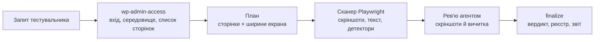

# WP QA Agent

Інструментарій контролю якості сайтів на WordPress і WooCommerce на базі AI-агента (Claude Code) і Playwright. Основний сценарій — перевірка того, що бачить відвідувач: **верстки й тексту**, коли в тестувальника є лише логін в адмінку.

## Яку проблему вирішує

Більшість дефектів, які помічає замовник, — не падіння сервера, а дрібниці на живих сторінках: верстка, що роз'їхалась на телефоні, текст, обрізаний кнопкою, шорткод замість форми, `Warning:` у футері, «кракозябри» після міграції, lorem ipsum на забутій сторінці, биті посилання й картинки. Автотести розробника їх рідко ловлять, а ручний перегляд забирає години.

Водночас у QA-інженера агенції чи підрядника зазвичай немає ні SSH, ні WP-CLI, ні коду теми — тільки обліковий запис у wp-admin. Класичні інструменти (PHPUnit, PHPCS, фікстури через WP-CLI) у такій ситуації не працюють.

WP QA Agent закриває цю прогалину:

- тестувальник пише завдання звичайною мовою: «перевір контакти на мобілці», «порівняй головну після оновлення плагіна»;
- агент складає план, детермінований сканер обходить сторінки на кількох ширинах екрана, агент переглядає скріншоти й вичитує текст;
- на виході — звіт із доказами (скріншот, URL, ширина екрана, цитата) і реєстр дефектів.

## Для кого

- QA-інженери й менеджери проєктів у веб-агенціях, що супроводжують клієнтські сайти;
- команди підтримки, які оновлюють плагіни й теми і мають переконатися, що нічого не зламалось;
- власники сайтів, яким потрібна «вичитка» сайту перед запуском кампанії.

## Що перевіряється

| Категорія | Приклади | Як знаходиться |
|---|---|---|
| Верстка | горизонтальний скрол на телефоні, перекриті кнопки, обрізаний текст, розтягнуті чи биті зображення | автоматичні детектори + перегляд скріншотів агентом |
| Технічний текст | шорткоди `[contact-form-7 …]`, `Warning:` / `Fatal error`, `&nbsp;` і `{{змінні}}` у тексті, кракозябри | автоматичні детектори |
| Зміст | lorem ipsum і стандартні тексти WordPress, повтори слів, змішані алфавіти (`Kиїв`), російські літери на українській сторінці | детектори + вичитка агентом |
| Мова | друкарські й граматичні помилки, неперекладені рядки, змішування мов | вичитка агентом мовою сторінки |
| Доступність сторінок | 4xx/5xx сторінок і ресурсів, биті внутрішні посилання, помилки в консолі | автоматичні детектори |
| Зміни | візуальна й текстова різниця до/після оновлення | порівняння з еталоном (baseline) |

Повний каталог дефектів: [`skills/wp-visual-content-qa/references/defect-catalog.md`](skills/wp-visual-content-qa/references/defect-catalog.md).

## Як це працює



1. **Доступ.** Агент один раз входить у wp-admin, визначає тип середовища (Site Health), версію WordPress, активні плагіни, мови й перелік сторінок (REST API або карта сайту).
2. **План.** Запит перетворюється на конкретний список сторінок і ширин екрана (360, 768, 1366, 1920 px). Широкий запит спершу показується людині.
3. **Сканування.** Сканер відкриває кожну сторінку як анонімний відвідувач, робить повні скріншоти, витягує текст і запускає детектори.
4. **Рев'ю.** Агент підтверджує або відхиляє кожну автоматичну знахідку й додає те, чого автоматика не бачить: друкарські помилки, криву верстку, неперекладений текст.
5. **Вердикт.** Скрипт `finalize` рахує вердикт за фіксованими правилами — агент не може сам поставити `PASS`.

## Безпека: чому інструмент можна запускати на робочому сайті

| Механізм | Що гарантує | Межі |
|---|---|---|
| Сканер лише читає | тільки GET-запити; єдиний POST — форма входу; запити сторінки на запис до сайту блокуються | — |
| Фільтр URL | не відкриваються посилання з `_wpnonce`, `action=`, `add-to-cart`, `logout`, `admin-ajax.php`, `xmlrpc.php`; у wp-admin — лише сторінки з білого списку | — |
| Хук для браузерних MCP | кліки, введення тексту, завантаження файлів через Playwright MCP / Chrome DevTools MCP потребують підтвердження людини | перехід за адресою (GET) через MCP дозволений без запиту, тому фільтр URL сканера лишається окремою лінією захисту; хук у `.claude/settings.json` перевірений у цьому репозиторії, копія хука в `hooks/hooks.json` (для встановлення плагіна) наживо з браузерним MCP не перевірялась |
| Write / Deletion Guard | скрипти проєкту питають підтвердження перед зміною чи видаленням | це функції для скриптів; команди, які агент запускає в терміналі напряму, контролює стандартний механізм дозволів Claude Code |
| Pre-commit хук | не дає закомітити видалення реєстру тестів і дефектів | навмисне видалення — з `QA_ALLOW_DELETION=true` |

Пароль адміністратора зберігається лише в `.env.qa`, сесія — в `.auth/`; обидва поза git і ніколи не виводяться в лог.

## Швидкий старт

Потрібно: Node.js 22 LTS, Git, Claude Code.

```bash
git clone <repo-url> wp-qa-agent && cd wp-qa-agent
npm install
npx playwright install chromium
cp config/wordpress-qa.example.env .env.qa   # QA_BASE_URL, QA_ADMIN_USER, QA_ADMIN_PASSWORD
claude --plugin-dir .
```

У сесії Claude Code:

```text
/wp-qa-agent:wp-check перевір головну і сторінку контактів на мобільному
```

Двофакторна автентифікація чи капча на вході: `npm run qa:inventory -- --login-manual` відкриє браузер, ви увійдете вручну, сесія збережеться.

## Приклади запитів

| Запит | Що зробить агент |
|---|---|
| «перевір головну і контакти на мобілці» | 2 сторінки × 360 і 768 px |
| «пройдись по всьому сайту і знайди помилки в тексті» | усі сторінки зі списку, 1366 px, вичитка тексту; план покаже перед запуском |
| «я поміняв меню — глянь, чи нічого не поїхало» | головна й ключові сторінки на 4 ширинах |
| «зроби baseline перед оновленням Elementor» | знімки й текст ключових сторінок як еталон |
| «порівняй після оновлення» | ті самі сторінки проти еталона, різниця — на рев'ю |

## Результат

Кожен запуск створює `qa/runs/<run-id>/`:

```text
plan.json          план перевірки
records/           дані кожної перевіреної сторінки×ширини, включно з відхиленими запитами
screenshots/       повні скріншоти сторінок
text/              витягнутий текст сторінок
detections.json    автоматичні знахідки й покриття
diffs/             візуальна різниця до/після (тільки в режимі порівняння)
review.json        рішення агента по кожній знахідці
summary.json       вердикт і причини
report.md          звіт для людини
```

Підтверджені дефекти потрапляють у `qa/findings.json` зі статусом `OPEN`. Закрити дефект (`CLOSED`) може тільки людина.

| Вердикт | Значення |
|---|---|
| `PASS` | усе заплановане проскановано й оцінено, дефектів немає |
| `FAIL` | є підтверджені дефекти |
| `REVIEW` | потрібне рішення людини: не все проскановано, є неоцінені знахідки чи зміни, немає еталона |
| `BLOCKED` | сайт недоступний або вхід не вдався |

## Режими й статус

| Режим | Як запустити | Статус |
|---|---|---|
| Візуальна й текстова перевірка за запитом | `/wp-qa-agent:wp-check <запит>` | Стабільний |
| Еталон і порівняння до/після | `/wp-qa-agent:wp-check зроби baseline …` / `… порівняй …` | Стабільний |
| Інвентар сайту через wp-admin | `npm run qa:inventory` | Стабільний |
| Прогін наявних Playwright E2E-тестів | `npm run qa:fast` | Стабільний (потрібні тести в `tests/`) |
| PHPCS і PHPUnit | `npm run qa:full` | Експериментальний: лише за наявності коду й `vendor/bin` |
| Перевірка оновлень у скрипті | `npm run qa:update` | В розробці: виконує лише E2E, вердикт не вище `REVIEW`; для порівняння — `/wp-qa-agent:wp-check` |
| Генерація тестів (Planner/Generator) у скрипті | `npm run qa:plan` | В розробці: використовуйте скіл `playwright-test-planner` |
| Прибирання фікстур у скрипті | `npm run qa:cleanup` | В розробці: нічого не видаляє |
| Доступність (Axe) | — | В розробці |

Для локальних і staging-сайтів із доступом через WP-CLI є окремий CI-подібний процес: команда `/wp-qa-agent:wordpress-qa` і скіли `wordpress-*` (див. `AGENTS.md`).

## Обмеження

- Орфографію й мову оцінює AI-агент, а не словник: на великих обсягах він уважніший за людину, але не безпомилковий. Кожна така знахідка позначена як «агент» і має цитату.
- Детектори розраховані на письмо зліва направо.
- Кабінет покупця й закриті розділи скануються тільки від імені адміністратора.
- Вміст, що з'являється лише після дії (попапи, вкладки, акордеони), автоматично не розкривається.
- Швидкодія, SEO й безпека не перевіряються.

## Структура репозиторію

```text
skills/            скіли агента: wp-admin-access, wp-visual-content-qa і CI-скіли wordpress-*
commands/          команди /wp-qa-agent:wp-check і /wp-qa-agent:wordpress-qa
scripts/           CLI: wp-inventory, visual-qa, run-qa, guard-хуки
lib/               детектори, фільтр URL, вердикти, реєстр дефектів, звіт
tests/             unit-, інтеграційні тести й тести детекторів на фейковому WordPress
qa/                реєстр тестів і дефектів, результати запусків
.claude-plugin/    маніфест плагіна Claude Code
```

## Розробка

```bash
npm run verify     # unit + детектори + інтеграційні тести
```

Скіли `wp-admin-access` і `wp-visual-content-qa` перевірялись прогонами `claude -p` без інтерактивного термінала проти фейкового WordPress-сервера (`tests/support/serve-fake-wp.mjs`): результати — в [`docs/superpowers/evals/2026-09-27-wp-check-eval.md`](docs/superpowers/evals/2026-09-27-wp-check-eval.md).

## Ліцензія

MIT
